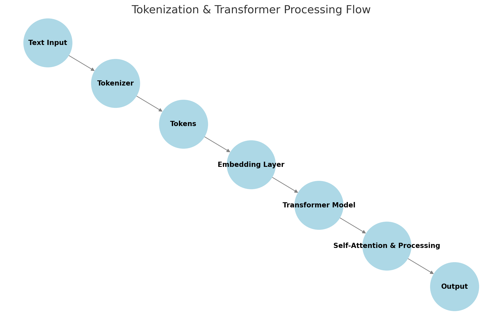

# Understanding Tokenization and Transformers

## 1️⃣ What is Tokenization?
Tokenization is the **first step** in processing text before passing it to a transformer model.

- It **splits** text into tokens (smaller units like words, subwords, or characters).
- Example (GPT-2 tokenizer):
  ```
  "unhappiness" → ["un", "happiness"]
  "transformers" → ["transform", "ers"]
  ```
- This step is necessary because **LLMs don’t process raw text; they process numerical representations of tokens**.

---

## 2️⃣ What is a Transformer?
A **transformer** is a deep learning model architecture used in LLMs (like GPT, BERT). It processes sequences of tokens **using self-attention mechanisms**.

### 🔹 Key Components of Transformers:
- **Token Embeddings**: Converts tokens into vectors (numerical representations).
- **Self-Attention**: Helps the model understand relationships between words (e.g., "bank" in "I went to the bank" vs. "The riverbank").
- **Feedforward Layers**: Processes embeddings to improve understanding.
- **Positional Encoding**: Helps the model understand word order.

---

## 3️⃣ Relationship Between Tokenization and Transformers
- Tokenization **happens before** the transformer processes text.
- Transformers **do not tokenize** by themselves—they **work on tokenized input**.
- The tokenizer and transformer must **match** (e.g., a BERT model must use a BERT tokenizer).

---

## Transformer Process


---

## Summary
✔ **Tokenization**: Converts text into tokens (preprocessing step).  
✔ **Transformer**: Processes tokenized input using self-attention & deep learning.  
✔ **They are related but not the same!** 🚀

---


